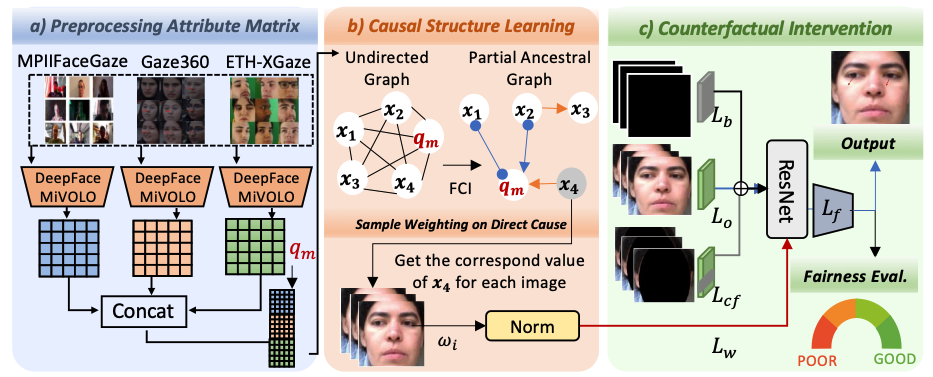

# Causal Insights into Fairness for Appearance-Based Gaze Estimation

This repository contains the implementation and reproducibility package for
**Causal Insights into Fairness for Appearance-Based Gaze Estimation**.



The code supports:

- our method training/evaluation,
- demographic and morphology-based fairness evaluation.

> This repository does **not** redistribute ETH-XGaze, MPIIFaceGaze, Gaze360,
> or other third-party datasets. Please obtain each dataset from the original
> providers and update the local paths in `configs/data_path.yaml`.

## Repository Structure

```text
configs/
  data_path.yaml              # local dataset paths; edit this for your machine
  datasets/                   # dataset configs and fixed subject/file lists
  models/                     # model configs for Ours, ResNet18, PureGaze
datasets/                     # PyTorch dataset loaders
networks/                     # model definitions
utils/                        # preprocessing, attribute, and gaze utilities
job/blank_only/               # SLURM scripts used for reported experiments
main.py
```

## Environment

The reported experiments were run with:

- Python 3.9.25
- PyTorch 2.4.0+cu118
- NumPy 1.26.4
- pandas 2.2.2
- SciPy 1.13.1
- scikit-learn 1.5.1
- OpenCV 4.10.0
- Pillow 10.3.0
- TensorFlow 2.19.0
- Keras 3.9.2
- MediaPipe 0.10.15
- DeepFace 0.0.93

Example setup:

```bash
python -m venv gaze_env
source gaze_env/bin/activate
pip install -r requirements.txt

## Data Configuration

Edit `configs/data_path.yaml` so each key points to your local dataset location.
For public release, replace private absolute paths with your own local paths or
make a copy such as `configs/data_path.yaml.example`.

The main cross-dataset settings use:

- `xgaze`: ETH-XGaze H5 files
- `mpii`: MPIIFaceGaze H5 files
- `gaze360_train`: Gaze360 training H5 folder
- `gaze360_test`: Gaze360 test H5 folder

## Reproducibility Settings

The main causal training script fixes the random seed to `42` for NumPy and
PyTorch.

Default causal-model training settings in `main.py`:

- optimizer: Adam
- learning rate: `1e-4`
- scheduler: StepLR
- scheduler step size: `5`
- scheduler decay factor: `0.1`
- epochs: `15`
- training batch size: `200`
- test loader: deterministic, `shuffle=False`

## Model Configs

Model configs are in `configs/models/`:

- Ours: `configs/models/causalres18.yaml`
- ResNet18: `configs/models/res18.yaml`
- PureGaze: `configs/models/puregaze.yaml`

## Training and Evaluation

### Train or Evaluate Our Causal Model

Train/evaluate with `main.py`.

Example training command:

```bash
python main.py \
  --exp_name mpii_to_mpii \
  --model_cfg_path configs/models/causalres18.yaml \
  --output_dir logs_ours_average \
  --lambda_cf 0.0 \
  --lambda_cf_bg 0.0 \
  --lambda_dc 0.0 \
  --confound_attr average_eye_height \
  --batch_size 200 \
  --num_workers 18
```

Example evaluation-only command:

```bash
python main.py \
  --exp_name gaze360_to_mpii \
  --checkpoint /path/to/checkpoint.pth.tar \
  --eval_only \
  --test_type ours \
  --confound_attr average_eye_height
```

## Confound Attribute Preprocessing

The scripts in `utils/` and `job/blank_only/` add morphology attributes to the
H5 files.

Main script:

```bash
python utils/add_confound_attr_to_h5.py \
  --attr bitemporal_width \
  --folder /path/to/h5_folder
```

## Fairness Evaluation

Fairness and morphology-based robustness evaluation is run through
`main.py` and related scripts such as:

```text
test_eh_fairness.py
```
